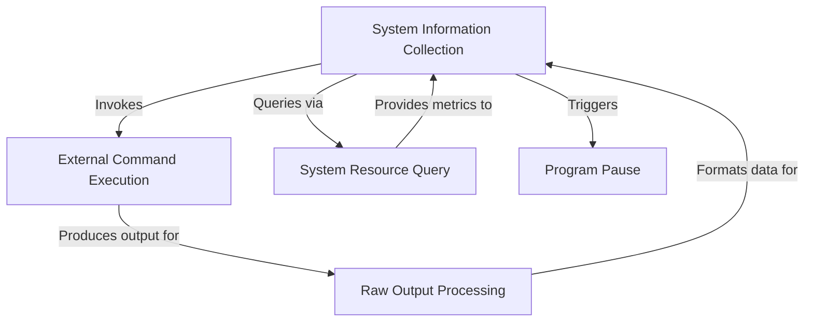
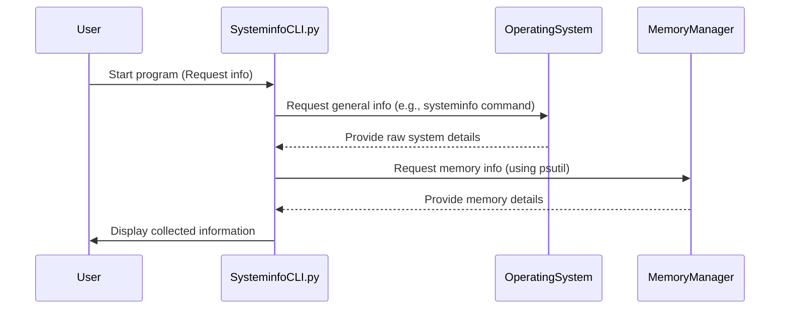
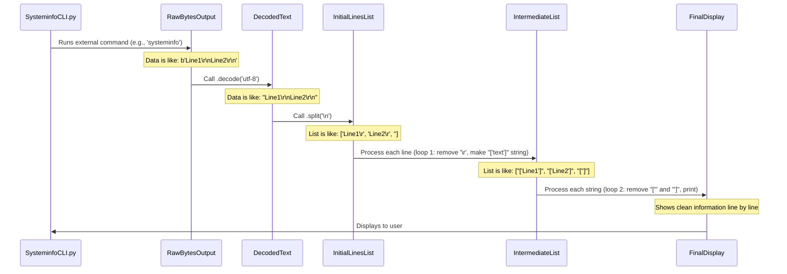

# Tutorial: Systeminfo-Cli

This project, `Systeminfo-Cli`, is a simple command-line tool designed to **gather and display information** about your computer. It acts like a digital detective, running *built-in system commands* to collect details on your hardware and software, and then *neatly processes* and presents this data. It also uses a special library to directly check things like your *memory usage*. Finally, it **pauses** so you have time to review all the collected information.


## Visual Overview



## Chapters

1. System Information Collection

2. External Command Execution

3. System Resource Query

4. Raw Output Processing

5. Program Pause


---

# Chapter 1: System Information Collection

Have you ever wondered what's inside your computer, or how much memory it has? It's a bit like wanting to know the "specs" of your car or the ingredients of your favorite snack! Your computer has lots of important details – its operating system, how much memory (RAM) it has, its processor type, and much more. This collection of details is what we call "System Information."

Our `Systeminfo-Cli` project is like a super helpful reporter whose job is to gather all these facts about your computer and present them to you in an easy-to-read way. It collects data from different "departments" of your computer to give you a complete picture of its current state.

### How Does it Work? (A Simple Look)

Let's see a simple example of how `Systeminfo-Cli` helps us collect this information. Imagine you just want to quickly see your computer's basic details and how much memory it has.

Here's a simplified version of the code that does just that:

```python
import subprocess
import psutil # A helpful tool for system info

# 1. Ask the computer for basic system details
# This is like asking the "main office" for general facts
system_details_raw = subprocess.check_output(['systeminfo'])
# Convert raw data into readable text
system_details_text = system_details_raw.decode('utf-8')

print("--- General System Information ---")
print(system_details_text[:500]) # Print first 500 characters for brevity

# 2. Ask the computer about its memory
# This is like asking the "memory department" specifically
memory_info = psutil.virtual_memory()

print("\n--- Memory Information ---")
print(f"Total Memory: {memory_info.total / (1024**3):.2f} GB")
print(f"Available Memory: {memory_info.available / (1024**3):.2f} GB")
# We simplified the output for clarity here
```

**What's Happening Here?**

This small piece of code uses special tools to "talk" to your computer:

*   `subprocess.check_output(['systeminfo'])` asks your computer to run a built-in command called `systeminfo`. This command is a powerful tool provided by your operating system that gives back a lot of details about your computer.
*   `psutil.virtual_memory()` is another tool (from a helpful library called `psutil`) that specifically gets information about your computer's memory (RAM).

**What You'll See:**

When you run a program using this code, you'll see a lot of text appear on your screen. First, it will show many lines of details from the `systeminfo` command, like your operating system name, processor, network settings, and more. After that, you'll see specific lines about your computer's memory, for example:

```
--- General System Information ---
OS Name:                   Microsoft Windows 10 Pro
OS Version:                10.0.19045 N/A Build 19045
OS Manufacturer:           Microsoft Corporation
OS Configuration:          Member Workstation
OS Build Type:             Multiprocessor Free
... (many more lines of system info) ...

--- Memory Information ---
Total Memory: 8.00 GB
Available Memory: 4.50 GB
```

### Under the Hood: How the Reporter Gathers Facts

So, how does our `Systeminfo-Cli` reporter actually get all these facts? Let's walk through the steps like a little story.

1.  **You Start the Inquiry:** You (the user) tell `Systeminfo-Cli` that you want to know about your system.
2.  **Reporter Asks Around:** `Systeminfo-Cli` then acts as an interviewer. It asks your computer's "Operating System" (the main program that manages everything) for general details, using a command like `systeminfo`.
3.  **Facts Start Coming In:** The "Operating System" replies with a long list of raw facts.
4.  **Specialist Interview:** `Systeminfo-Cli` also asks a special "Memory Manager" part of your computer for specific memory details.
5.  **More Facts Arrive:** The "Memory Manager" replies with precise memory facts.
6.  **Report is Compiled and Shown:** Finally, `Systeminfo-Cli` takes all these facts, organizes them a bit, and shows them to you on the screen.

Here's a simple diagram showing this process:



#### Diving into the Code

Now, let's look at the actual code from the `SysteminfoCLI.py` file to see how these steps are put into action.

**1. Getting General System Information**

```python
import subprocess # Tool to run other programs

# This line runs the 'systeminfo' command
# and captures its output (like receiving a report).
system_report_raw = subprocess.check_output(['systeminfo'])

# The .decode('utf-8') turns the raw computer data into readable text.
# .split('\n') breaks the text into separate lines.
Id = system_report_raw.decode('utf-8').split('\n')

# The code below then processes these lines to clean them up.
# We'll learn more about this 'Raw Output Processing' in
# [Chapter 4: Raw Output Processing](04_raw_output_processing_.md).
# For now, just know it makes the text nicer to read.
new = []
for item in Id:
    new.append(str(item.split('\r')[:-1]))
for i in new:
    print(i[2:-2])
```

The most important part here is `subprocess.check_output(['systeminfo'])`. This is a powerful feature in Python that lets our script run other programs or commands on your computer, just like you would type them in a command prompt! This is a core way `Systeminfo-Cli` gathers facts, and we'll learn much more about it in [Chapter 2: External Command Execution](02_external_command_execution_.md). The rest of the code helps make the output pretty.

**2. Getting Memory Information**

```python
import psutil # A tool to get system details easily

# This line gets detailed information about your computer's memory.
# It's like asking a "memory specialist" for their report.
print(f"Memory :{psutil.virtual_memory()}")
```

The `psutil` library is a wonderful tool that makes it easy for Python programs to get information about your system, like memory usage, CPU usage, and more, without needing to run external commands directly. `psutil.virtual_memory()` specifically gets details about your computer's RAM. We'll explore more about getting specific system resources in [Chapter 3: System Resource Query](03_system_resource_query_.md).

**3. Pausing the Program**

```python
import os # A tool for interacting with the operating system

# This line keeps the command window open after the info is displayed.
# It's like telling the reporter to wait for you to finish reading the report.
os.system("pause")
```

The `os.system("pause")` line is there just to keep the command window open after the program finishes, so you have time to read all the information that scrolled by. It's not part of the information collection itself, but a helpful trick for users. We'll talk more about this in [Chapter 5: Program Pause](05_program_pause_.md).

### Conclusion

In this chapter, we learned that `Systeminfo-Cli` acts like a dedicated reporter, collecting various important facts about your computer's hardware and software. We saw how it uses commands like `systeminfo` and special tools like `psutil` to gather general system details and specific memory information. This entire process is about "System Information Collection."

We also got a peek at how the program runs external commands and processes their output to present you with a clear picture. Ready to learn more about how our reporter asks its questions from external sources? Let's move on to [Chapter 2: External Command Execution](02_external_command_execution_.md)!

---

</sup></sub> <sub><sup>**References**: [[1]](https://github.com/Hack-Stone/Systeminfo-Cli/blob/c61526b08a124f571d193a49597ea0d9ddf54bcf/SysteminfoCLI.py)</sup></sub>
# Chapter 2: External Command Execution

Welcome back! In [Chapter 1: System Information Collection](01_system_information_collection_.md), we learned that our `Systeminfo-Cli` project acts like a reporter, gathering facts about your computer. We saw how it used commands like `systeminfo` to get those details. But how exactly does a Python program "run" another command as if you typed it yourself? That's what "External Command Execution" is all about!

### What's the Big Idea? (The Robot Arm Analogy)

Imagine you have a very smart robot arm, but it doesn't know how to do everything itself. Instead, it knows how to press buttons on other machines' control panels. When you want to, say, make coffee, you don't teach the robot how to brew; you just tell it, "Press the 'Brew Coffee' button on the coffee machine!"

In the world of computers, our Python script (`Systeminfo-Cli`) is like that robot arm. It doesn't know *every* single detail about your computer directly. But your computer's operating system (like Windows, macOS, or Linux) has many special tools and programs built-in that *do* know. These are the "external commands."

**External Command Execution** is simply our Python script's ability to "press buttons" (run these external commands) to get specific information or perform tasks. It's super useful because it lets our script use powerful tools that already exist, rather than having to build them from scratch!

A common external command we use is `systeminfo`. When you type `systeminfo` into your computer's command prompt and press Enter, it gives you a whole bunch of details about your system. Our `Systeminfo-Cli` script does the exact same thing, but automatically!

### How Does Our Script "Press the Button"?

Python has a special helper called the `subprocess` module. Think of `subprocess` as the robot arm's brain that understands how to "press" different command buttons.

To run an external command and capture its output (what it prints back), we use a function inside `subprocess` called `check_output()`.

Let's see a simple example:

```python
import subprocess

# Imagine we want to list the files in the current folder.
# On Windows, you might type 'dir'. On Linux/macOS, you type 'ls'.
# Let's use 'dir' for this example.
# The command goes inside a list: ['dir']
raw_output = subprocess.check_output(['dir'])

# The output comes back as raw computer data (bytes).
# We need to turn it into readable text using .decode('utf-8').
readable_text = raw_output.decode('utf-8')

print("--- Files in this Folder (using 'dir' command) ---")
# We only print the first 200 characters to keep it short!
print(readable_text[:200])
```
**What's Happening Here?**

1.  `import subprocess`: We tell Python we want to use the `subprocess` robot arm.
2.  `subprocess.check_output(['dir'])`: We tell the robot arm to "press the 'dir' button." The `dir` command runs in the background, collects information (a list of files), and gives it back to our Python script.
3.  `raw_output.decode('utf-8')`: The information comes back in a computer-friendly format called "bytes." We use `.decode('utf-8')` to translate those bytes into human-readable text. It's like having a translator turn a secret code into plain English!

Now, let's see how `Systeminfo-Cli` uses this to get all those details from `systeminfo`:

```python
import subprocess

# This is how Systeminfo-Cli gets the general system details.
# It runs the 'systeminfo' command.
system_details_bytes = subprocess.check_output(['systeminfo'])

# Just like before, we decode the raw data into readable text.
system_details_text = system_details_bytes.decode('utf-8')

print("--- Detailed System Information (from 'systeminfo' command) ---")
# We print the first 500 characters, as 'systeminfo' provides a lot!
print(system_details_text[:500])
```
**Output Example:**
When you run this code, you'll see a lot of text similar to what you'd see if you typed `systeminfo` yourself in the command prompt:

```
--- Detailed System Information (from 'systeminfo' command) ---
OS Name:                   Microsoft Windows 10 Pro
OS Version:                10.0.19045 N/A Build 19045
OS Manufacturer:           Microsoft Corporation
... (many more lines of system info) ...
```

### Under the Hood: How the Command Gets Executed

Let's trace what happens when our `Systeminfo-Cli` script uses `subprocess.check_output(['systeminfo'])`:

1.  **Script Asks the OS:** Our `SysteminfoCLI.py` script doesn't run `systeminfo` directly. Instead, it asks the computer's **Operating System (OS)** to do it. Think of the OS as the "manager" of all programs.
2.  **OS Launches Command:** The **Operating System** then finds the `systeminfo` program and tells it to start running.
3.  **Command Does Its Job:** The **`systeminfo` command** gathers all the system details and prints them out (though we don't see it directly on our screen when Python captures it).
4.  **OS Collects Output:** The **Operating System** collects everything `systeminfo` printed.
5.  **OS Gives Back to Script:** Finally, the **Operating System** passes this collected output back to our waiting `SysteminfoCLI.py` script.

Here's a simple diagram showing this process:

```mermaid
sequenceDiagram
    participant SysteminfoCLI.py
    participant OperatingSystem
    participant ExternalCommand

    SysteminfoCLI.py->>OperatingSystem: "Run 'systeminfo' for me!"
    OperatingSystem->>ExternalCommand: "Hey, 'systeminfo', start now!"
    ExternalCommand-->>OperatingSystem: "Here's my system output!"
    OperatingSystem-->>SysteminfoCLI.py: "Here's the output you asked for."
    SysteminfoCLI.py: Note over SysteminfoCLI.py: Processes the raw output into readable text.
```

#### Diving into the Code (from `SysteminfoCLI.py`)

Now, let's look at the actual lines from the `SysteminfoCLI.py` file that perform this external command execution:

```python
import subprocess # This tool helps us run external commands!

# This is the key line!
# It runs the 'systeminfo' command and captures its entire output.
# The output is raw data (bytes) at this stage.
Id = subprocess.check_output(['systeminfo'])

# This part converts the raw bytes into readable text,
# and then splits the text into a list of separate lines.
Id = Id.decode('utf-8').split('\n')

# The code below then goes through each line to clean it up.
# We'll learn more about this 'Raw Output Processing' in
# [Chapter 4: Raw Output Processing](04_raw_output_processing_.md).
# For now, just know it makes the text nicer to read.
new = []
for item in Id:
    new.append(str(item.split('\r')[:-1]))
for i in new:
    print(i[2:-2])
```
In these lines, `subprocess.check_output(['systeminfo'])` is the heart of external command execution for `Systeminfo-Cli`. It's how the script gets its initial big chunk of system data. The subsequent lines (`.decode('utf-8').split('\n')` and the loops) are all about making that raw, captured text pretty and usable, which is a topic for another chapter!

### Conclusion

In this chapter, we unpacked the concept of "External Command Execution." We learned that our `Systeminfo-Cli` project doesn't know everything itself, but it's smart enough to ask other programs (external commands) like `systeminfo` to do the heavy lifting. We saw how Python's `subprocess.check_output()` function acts like a robot arm, running these commands and collecting their output. This ability to run external tools is a powerful way for Python scripts to interact with the operating system and gather diverse information.

But what if we don't want to rely on external commands for *all* information? What if there's an easier, more direct way to ask about things like memory? That's exactly what we'll explore in the next chapter!

Ready to discover another way our reporter gathers facts? Let's move on to [Chapter 3: System Resource Query](03_system_resource_query_.md)!

---

</sup></sub> <sub><sup>**References**: [[1]](https://github.com/Hack-Stone/Systeminfo-Cli/blob/c61526b08a124f571d193a49597ea0d9ddf54bcf/SysteminfoCLI.py)</sup></sub>
# Chapter 3: System Resource Query

Welcome back, future system experts! In [Chapter 2: External Command Execution](02_external_command_execution_.md), we learned how our `Systeminfo-Cli` project uses Python's `subprocess` tool to run external commands like `systeminfo`. That's a powerful way to get lots of general details about your computer by reading the output of these commands.

But what if you need very specific, real-time information about your computer's health? For example, how much memory (RAM) is *currently* being used? Or how busy its processor is right now? Running external commands for this can be like getting a huge, messy paper report and trying to find one specific number. It's often slow and difficult to get just the piece of data you need in a clear, usable format.

### What's the Big Idea? (The Car Diagnostic Tool Analogy)

Imagine you own a car, and you want to know its exact oil pressure or engine temperature right this second. You *could* open the hood, find the right sensor, and try to read a tiny dial. Or, you could take it to a mechanic who has a special "diagnostic tool." This tool plugs directly into the car's computer, bypassing all the external dials, and gives you precise numbers for everything, clearly displayed on a screen.

In the world of computers, our Python script needs a similar "diagnostic tool" to get detailed system resources. **System Resource Query** is about using a specialized Python library called `psutil` (pronounced "p-s-util") that acts like that diagnostic tool. It can directly "plug into" your computer's operating system to read detailed metrics like memory usage, CPU activity, disk space, and more, without needing to run external programs and parse their text output.

This allows our `Systeminfo-Cli` project to get accurate, structured data about your computer's internal state.

### How Does Our Script "Plug In"?

Python has a fantastic library called `psutil` specifically designed for getting system and process information. Instead of running a command and reading its text, `psutil` talks directly to your computer's operating system in a much more direct way. It then gives you the information in a neat, easy-to-use Python format.

Let's see a simple example focusing on memory, which is one of the key resources `Systeminfo-Cli` queries:

```python
import psutil # Our specialized diagnostic tool!

# This line asks psutil to directly query your computer's memory details.
# It returns a special object with lots of memory facts.
memory_report = psutil.virtual_memory()

print("--- Current Memory (RAM) Information ---")
# psutil objects have clear names for each piece of data.
# We divide by (1024**3) to convert bytes into Gigabytes (GB).
print(f"Total Memory: {memory_report.total / (1024**3):.2f} GB")
print(f"Used Memory: {memory_report.used / (1024**3):.2f} GB")
print(f"Available Memory: {memory_report.available / (1024**3):.2f} GB")
print(f"Memory Usage Percentage: {memory_report.percent}%")
```

**What's Happening Here?**

1.  `import psutil`: We bring in the `psutil` library, telling Python we want to use its specialized tools.
2.  `psutil.virtual_memory()`: This is the core function call. It's like asking `psutil` to "plug into the memory part" of your computer. `psutil` then goes directly to the operating system's internal systems to gather all the memory details.
3.  `memory_report`: The information comes back not as raw text, but as a special kind of Python "object" (like a neatly organized folder of facts). This object has clearly labeled pieces of data inside it, such as `total`, `used`, `available`, and `percent`.
4.  `print(f"Total Memory: {memory_report.total / (1024**3):.2f} GB")`: We can then easily access these pieces of data using the `.` (dot) notation (e.g., `memory_report.total`). We also do a little math (`/ (1024**3)`) to convert the large numbers (bytes) into more readable Gigabytes (GB) and `:.2f` to show only two decimal places.

**Output Example:**

When you run this code, you'll see a clear summary of your computer's memory:

```
--- Current Memory (RAM) Information ---
Total Memory: 8.00 GB
Used Memory: 3.50 GB
Available Memory: 4.50 GB
Memory Usage Percentage: 43.75%
```

This is much easier to work with than trying to find these numbers in a big block of text from an external command!

### Under the Hood: How the Query Works

So, how does `psutil` get this information so directly? It doesn't run commands you'd type in a terminal. Instead, it uses special "Application Programming Interfaces" (APIs) provided by the operating system itself. Think of APIs as special direct "phone lines" or "secret doors" that programs can use to talk directly to different parts of the operating system.

Let's trace what happens when our `Systeminfo-Cli` script uses `psutil.virtual_memory()`:

1.  **Script Asks `psutil`:** Our `SysteminfoCLI.py` script asks the `psutil` library: "Hey `psutil`, can you get me the memory details?"
2.  **`psutil` Calls OS Directly:** The `psutil` library then makes a direct "API call" to the computer's **Operating System (OS)**. It's like a specialized doctor directly asking the car's computer for data.
3.  **OS Provides Data:** The **Operating System**, through its internal APIs, provides the raw memory statistics directly to `psutil`.
4.  **`psutil` Organizes Data:** `psutil` takes this raw data and organizes it into that neat, easy-to-use Python "object" (like the `memory_report` we saw).
5.  **`psutil` Gives Back to Script:** Finally, `psutil` gives this structured object back to our waiting `SysteminfoCLI.py` script.

Here's a simple diagram showing this process:

```mermaid
sequenceDiagram
    participant SysteminfoCLI.py
    participant psutilLibrary
    participant OperatingSystem

    SysteminfoCLI.py->>psutilLibrary: "Get virtual memory info!"
    psutilLibrary->>OperatingSystem: "Directly query memory APIs"
    OperatingSystem-->>psutilLibrary: "Here's raw memory data"
    psutilLibrary-->>SysteminfoCLI.py: "Here's memory data (as Python object)"
    SysteminfoCLI.py: Note over SysteminfoCLI.py: Accesses data like .total, .available
```

#### Diving into the Code (from `SysteminfoCLI.py`)

Now, let's look at the actual lines from the `SysteminfoCLI.py` file that perform this system resource query:

```python
import psutil # Our direct diagnostic tool!

# This line is the key! It gets a special "memory info" object from psutil.
# psutil talks directly to the OS here.
memory_report_object = psutil.virtual_memory()

# Systeminfo-Cli then simply prints this object.
# psutil is smart and knows how to format this object nicely when printed!
print(f"Memory :{memory_report_object}")
```

In the `Systeminfo-Cli` project, the `print(f"Memory :{psutil.virtual_memory()}")` line is quite concise. Even though it looks simple, behind the scenes, `psutil.virtual_memory()` is doing the direct querying, and the `psutil` library is designed to make its objects print out in a very readable way automatically! If we wanted to, we could, as shown in the earlier example, access specific parts like `memory_report_object.total` or `memory_report_object.percent` to use them in calculations or for more customized display.

### Comparing the Two Approaches

Let's quickly compare the two main ways `Systeminfo-Cli` gets information:

| Feature                       | `subprocess` (External Command Execution)       | `psutil` (System Resource Query)                  |
| :---------------------------- | :---------------------------------------------- | :------------------------------------------------ |
| **How it works**              | Runs separate command-line programs             | Directly talks to operating system's internal APIs |
| **Output format**             | Raw text (needs careful processing)             | Structured Python objects (easy to use)            |
| **Best for**                  | Getting general system info (like `systeminfo`), running any existing command, diverse tasks | Getting specific, real-time resource metrics (CPU, memory, disk, network) |
| **Analogy**                   | Asking a general assistant to fetch a full report | Plugging in a specialized diagnostic tool         |

Both methods are incredibly useful for `Systeminfo-Cli`, but they shine in different situations. `subprocess` is like the general-purpose tool, while `psutil` is the specialized, high-precision instrument.

### Conclusion

In this chapter, we explored "System Resource Query" and learned how `Systeminfo-Cli` uses the `psutil` library to get very specific and real-time details about your computer's resources, like its memory. We saw that `psutil` acts like a direct diagnostic tool, bypassing the need to run external commands and parse messy text. This gives our project a powerful way to collect accurate, structured data about your system's health.

But what happens to all that raw text output we get from commands like `systeminfo`? How does `Systeminfo-Cli` turn it into something clean and readable? That's what we'll tackle next!

Ready to learn how our reporter cleans up its notes? Let's move on to [Chapter 4: Raw Output Processing](04_raw_output_processing_.md)!

---

</sup></sub> <sub><sup>**References**: [[1]](https://github.com/Hack-Stone/Systeminfo-Cli/blob/c61526b08a124f571d193a49597ea0d9ddf54bcf/SysteminfoCLI.py), [[2]](https://github.com/Hack-Stone/Systeminfo-Cli/blob/c61526b08a124f571d193a49597ea0d9ddf54bcf/requirements.txt)</sup></sub>
# Chapter 4: Raw Output Processing

Welcome back, aspiring system experts! In [Chapter 2: External Command Execution](02_external_command_execution_.md), we learned how `Systeminfo-Cli` runs commands like `systeminfo` to get information. In [Chapter 3: System Resource Query](03_system_resource_query_.md), we saw how `psutil` directly queries system resources. Both methods bring us lots of data about your computer.

But here's a challenge: The information we get back from external commands like `systeminfo` isn't always neat and tidy. Imagine getting a big, crumpled-up grocery list with smudges, extra notes, and some foreign words. You wouldn't want to just hand that to your friend, right? You'd clean it up first!

### What's the Big Idea? (The Chef Analogy)

Think of our `Systeminfo-Cli` project as a skilled chef. When the chef gets ingredients, they aren't ready to eat directly. A potato needs peeling, chopping, and cooking. A piece of fish needs cleaning and seasoning.

**Raw Output Processing** is like that chef's work in the kitchen. Once `Systeminfo-Cli` gets the "raw ingredients" (unprocessed data) from commands or queries, this step is all about **cleaning it up and making it presentable**. It involves several actions:

*   **Decoding:** Turning computer codes into human-readable letters.
*   **Splitting:** Breaking a large block of text into individual lines.
*   **Stripping:** Removing unwanted "extra bits" like invisible characters or spaces.
*   **Formatting:** Arranging everything clearly so it's easy to read and understand.

The goal is to transform messy, raw computer data into a dish that's easy for *you* to consume and understand!

### How Does Our Script "Prepare the Dish"?

Let's focus on the output from `systeminfo` as our main "raw ingredient," because it often needs the most cleaning. When `systeminfo` runs, it gives back a single, long block of text. This text might contain things like:

*   **Bytes:** The actual computer data, not direct letters.
*   **Unwanted Characters:** Like `\r` (a "carriage return" character, often paired with `\n` for newlines, especially on Windows), or extra spaces.
*   **Python's Internal Representation:** Sometimes, when Python processes things, it adds characters like `['` and `']` around text if it's converting lists to strings.

Our `Systeminfo-Cli` script has to handle all of these to give you a clean report.

Let's look at the steps:

#### Step 1: Decoding - From Computer Bytes to Human Text

When `subprocess.check_output()` runs a command, it gives you back "bytes" – a raw computer format. It's like a secret code. We need to decode it into human-readable characters.

```python
import subprocess

# Imagine 'echo Hello!' command gives back bytes
raw_computer_data = subprocess.check_output(['echo', 'Hello from computer!'])
print(f"Raw data (bytes): {raw_computer_data}")

# Use .decode('utf-8') to turn bytes into readable text
readable_text = raw_computer_data.decode('utf-8')
print(f"Decoded text: {readable_text}")
```
**What's Happening Here?**
The `subprocess.check_output()` returns `b'Hello from computer!\r\n'`, where the `b'` indicates "bytes." The `.decode('utf-8')` method translates these bytes into the familiar `Hello from computer!\r\n` string.

#### Step 2: Splitting - Breaking into Lines

A long block of text is hard to read. We want to see each piece of information on its own line. We use `.split('\n')` to break the text wherever a newline character (`\n`) appears.

```python
# Continuing from the previous example, but with multiple lines:
long_text = "Line One\r\nLine Two\r\nLine Three\r\n"
print(f"Original long text: '{long_text}'")

# .split('\n') turns the text into a list of lines
list_of_lines = long_text.split('\n')
print(f"Text split into a list: {list_of_lines}")

print("\nNow, printing each line separately:")
for line in list_of_lines:
    print(f"- '{line}'")
```
**What's Happening Here?**
`long_text.split('\n')` takes the single string and creates a list like `['Line One\r', 'Line Two\r', 'Line Three\r', '']`. Notice the `\r` is still there, and there's an empty string at the end because the text ends with `\n`. This shows why more cleaning is needed!

#### Step 3: Stripping & Initial Cleaning - Removing Extra Bits (`\r`)

Many commands on Windows (like `systeminfo`) use `\r\n` for a new line. When we split by `\n`, the `\r` often remains at the end of each line, which can look messy. The `Systeminfo-Cli` code uses a clever trick with `split('\r')[:-1]` to deal with this and then a `str()` conversion.

Let's simplify and show the concept:

```python
# A line that still has the pesky '\r' at the end
messy_line = "OS Name: Windows 10 Pro\r"
print(f"Messy line: '{messy_line}'")

# Option 1: Using .replace('\r', '') to remove it
clean_line_1 = messy_line.replace('\r', '')
print(f"Cleaned with replace: '{clean_line_1}'")

# Option 2 (similar to what Systeminfo-Cli does indirectly):
# It effectively splits by '\r' and takes the first part
# (e.g., ['OS Name: Windows 10 Pro', ''] becomes ['OS Name: Windows 10 Pro'])
cleaned_parts = messy_line.split('\r')[:-1]
print(f"Cleaned with split + slice: {cleaned_parts}")

# In the actual Systeminfo-Cli code, this list is then converted to a string:
string_from_list = str(cleaned_parts)
print(f"String representation of list: '{string_from_list}'")
```
**What's Happening Here?**
`split('\r')[:-1]` is a trick to remove the `\r`. `split('\r')` would give `['OS Name: Windows 10 Pro', '']`. Adding `[:-1]` removes the last (empty) item, leaving `['OS Name: Windows 10 Pro']`. Then, `str(...)` turns *this list* into a string `"['OS Name: Windows 10 Pro']"`. Yes, this looks weird, but it's an intermediate step in the actual code!

#### Step 4: Final Formatting - Removing Python's List Brackets

Because of the `str(item.split('\r')[:-1])` step, our lines temporarily become strings that look like Python lists, for example: `"['OS Name: Windows 10 Pro']"`. We need to remove these `['` and `']` characters to get the clean text. We can do this using string "slicing."

```python
# A line that looks like a Python list string
raw_formatted_line = "['OS Name:                   Microsoft Windows 10 Pro']"
print(f"Before final cleaning: '{raw_formatted_line}'")

# Use slicing to remove the first two characters ([' ) and the last two ( ]')
final_clean_line = raw_formatted_line[2:-2]
print(f"After final cleaning: '{final_clean_line}'")
```
**What's Happening Here?**
`[2:-2]` means "start from the character at index 2 (the third character) and go all the way to the second-to-last character." This effectively chops off `['` from the start and `']` from the end.

### Under the Hood: How the Output Gets Processed Step-by-Step

Let's see the entire "chef's process" for the `systeminfo` output in `Systeminfo-Cli.py`:



#### Diving into the Code (from `SysteminfoCLI.py`)

Now, let's look at the actual lines from `SysteminfoCLI.py` that perform this raw output processing:

```python
import subprocess # Needed to run external commands

# 1. Run 'systeminfo', get raw bytes, then DECODE and SPLIT immediately.
# 'Id' becomes a list of strings, with each string ending in '\r' (on Windows).
Id = subprocess.check_output(['systeminfo']).decode('utf-8').split('\n')

new = [] # This will be our list to hold partially cleaned lines.

# 2. First cleaning loop: Process each 'item' (line) from the 'Id' list.
for item in Id:
    # item.split('\r') splits the line by '\r', like ['OS Name:', ''].
    # [:-1] removes the last (often empty) element, resulting in ['OS Name:'].
    # str(...) converts this single-item list into a string like "['OS Name:']".
    new.append(str(item.split('\r')[:-1]))

# 3. Second cleaning loop: Process each string 'i' from the 'new' list.
for i in new:
    # i[2:-2] removes the first 2 characters ("['") and the last 2 characters ("']")
    # from the string, leaving only the clean, readable text.
    print(i[2:-2])
```

As you can see, the `Systeminfo-Cli` code combines several processing steps to get the `systeminfo` output just right! The `psutil.virtual_memory()` output, on the other hand, is usually already structured nicely, so it just needs to be printed.

### Conclusion

In this chapter, we learned about "Raw Output Processing," which is like the chef's work to prepare raw ingredients. We saw how `Systeminfo-Cli` takes the messy raw text output from external commands, decodes it, splits it into lines, strips away unwanted characters like `\r`, and finally formats it by removing Python's temporary list-like string wrappers. This ensures that the information you see on your screen is clean, clear, and easy to read.

There's just one more small but helpful part of our `Systeminfo-Cli` project to explore: making sure you have enough time to read all that beautifully processed information!

Ready to learn about the final touch? Let's move on to [Chapter 5: Program Pause](05_program_pause_.md)!

---

</sup></sub> <sub><sup>**References**: [[1]](https://github.com/Hack-Stone/Systeminfo-Cli/blob/c61526b08a124f571d193a49597ea0d9ddf54bcf/SysteminfoCLI.py)</sup></sub>
# Chapter 5: Program Pause

Welcome back, system explorers! In our previous chapters, especially [Chapter 4: Raw Output Processing](04_raw_output_processing_.md), we learned how `Systeminfo-Cli` works hard to gather all sorts of details about your computer and then clean them up to make them perfectly readable for you. Imagine getting a beautifully organized report filled with facts about your system – your processor, memory, operating system, and more!

But here's a small problem: Command-line programs, like our `Systeminfo-Cli`, often run super fast. They do their job, print everything to the screen, and then close the window in a blink of an eye! If the program closes too quickly, you might miss all that valuable information you worked so hard to get. It's like a TV show ending with "To be continued..." and the screen instantly clears before you can even read it!

### What's the Big Idea? (The "Press Any Key" Analogy)

We need a way for our program to say, "Hold on a second! I've displayed all the information. Take your time to read it, and when you're ready, just tell me." This is where **Program Pause** comes in.

**Program Pause** is a simple trick that makes the program stop its execution and wait for *you*, the user, to press any key on your keyboard. It's like that classic message you sometimes see: "Press any key to continue..." This gives you plenty of time to read and absorb all the system information `Systeminfo-Cli` has presented, before the command window closes.

### How Does Our Script "Wait for You"?

Python has a helpful tool called the `os` module (short for "Operating System"). This module allows your Python script to talk to the operating system itself, letting it do things like running other small commands.

To make our program pause, we use a command that most operating systems (especially Windows, which `Systeminfo-Cli` is primarily designed for) understand: `"pause"`.

Here's how we tell our Python script to use this "pause" command:

```python
import os # Our tool to talk to the Operating System

print("Hello! Here's some info...")
print("... more info ...")
print("... even more info ...")

# This is the magic line that makes the program wait!
os.system("pause")

print("You pressed a key! Now I'm done.")
```

**What's Happening Here?**

1.  `import os`: We first tell Python that we want to use the `os` module.
2.  `os.system("pause")`: This is the key part! It tells the operating system to run its built-in `"pause"` command.
    *   When `"pause"` runs, it usually displays a message like "Press any key to continue..." or similar, and then literally waits for you to press a key.
    *   Once you press a key, the `"pause"` command finishes, and then our Python script continues its work (in this example, it would then print "You pressed a key! Now I'm done." and then finally close).

**Output You'll See:**

When you run a script with `os.system("pause")`, the output will look something like this:

```
Hello! Here's some info...
... more info ...
... even more info ...
Press any key to continue . . .
```
(At this point, the program is waiting. Nothing will happen until you press a key like Spacebar, Enter, or any letter key.)

Then, after you press a key:

```
Hello! Here's some info...
... more info ...
... even more info ...
Press any key to continue . . .
You pressed a key! Now I'm done.
```
And then the window will close (or the script will end, if you're running it in an environment that doesn't close windows automatically).

This simple line ensures you have all the time you need to read the `Systeminfo-Cli` report!

### Under the Hood: How the Pause Command Works

When your `Systeminfo-Cli` script encounters `os.system("pause")`, here's what happens:

1.  **Script Asks the OS:** Your `SysteminfoCLI.py` script asks the computer's **Operating System (OS)**, "Hey, can you run the 'pause' command for me?"
2.  **OS Launches Command:** The **Operating System** finds the built-in 'pause' command and starts it.
3.  **'pause' Command Waits:** The **External 'pause' Command** takes over your command window. It prints its message ("Press any key...") and then patiently waits for a key press from the user.
4.  **User Presses Key:** You (the **User**) press a key on the keyboard.
5.  **'pause' Command Finishes:** The **External 'pause' Command** detects the key press and tells the **Operating System** it's done.
6.  **OS Gives Control Back:** The **Operating System** gives control back to your `SysteminfoCLI.py` script, which then continues from where it left off (or finishes, if there's nothing left to do).

Here's a simple diagram showing this process:

```mermaid
sequenceDiagram
    participant SysteminfoCLI.py
    participant OperatingSystem
    participant ExternalCommand
    participant User

    SysteminfoCLI.py->>OperatingSystem: "Run 'pause' command!"
    OperatingSystem->>ExternalCommand: "Hey 'pause', start now and wait!"
    ExternalCommand->>User: "Press any key to continue..."
    User->>ExternalCommand: (Presses a key)
    ExternalCommand-->>OperatingSystem: "Key pressed, I'm done!"
    OperatingSystem-->>SysteminfoCLI.py: "Okay, you can continue now."
    SysteminfoCLI.py: Note over SysteminfoCLI.py: Program ends or continues.
```

Notice how `os.system()` is similar to `subprocess.check_output()` (which we learned about in [Chapter 2: External Command Execution](02_external_command_execution_.md)) in that both run external commands. The main difference is that `os.system()` runs the command and doesn't easily let your Python program capture its output directly, which is fine for a simple "pause" command.

#### Diving into the Code (from `SysteminfoCLI.py`)

Now, let's look at the actual lines from the `SysteminfoCLI.py` file that implement this program pause. This is usually the very last thing the script does:

```python
import os # We need this to talk to the operating system

# ... (Previous code for getting and printing system info goes here) ...

# This is the line that makes the program wait for you!
os.system("pause")
```
This single line, `os.system("pause")`, is what gives you control over when the program window closes. It ensures you have ample time to read all the system details beautifully presented by `Systeminfo-Cli`.

### Conclusion

In this final chapter, we discovered the simple but important concept of "Program Pause." We learned that by using `os.system("pause")`, our `Systeminfo-Cli` project can kindly wait for you to finish reading all the collected and processed system information before closing the command window. This little trick makes the program much more user-friendly, ensuring you get the most out of your system report.

You've now explored all the key concepts behind `Systeminfo-Cli`: from collecting information and running external commands to querying system resources, processing raw output, and finally, pausing the program for a great user experience! Congratulations on completing this tutorial!

---

</sup></sub> <sub><sup>**References**: [[1]](https://github.com/Hack-Stone/Systeminfo-Cli/blob/c61526b08a124f571d193a49597ea0d9ddf54bcf/SysteminfoCLI.py)</sup></sub>
